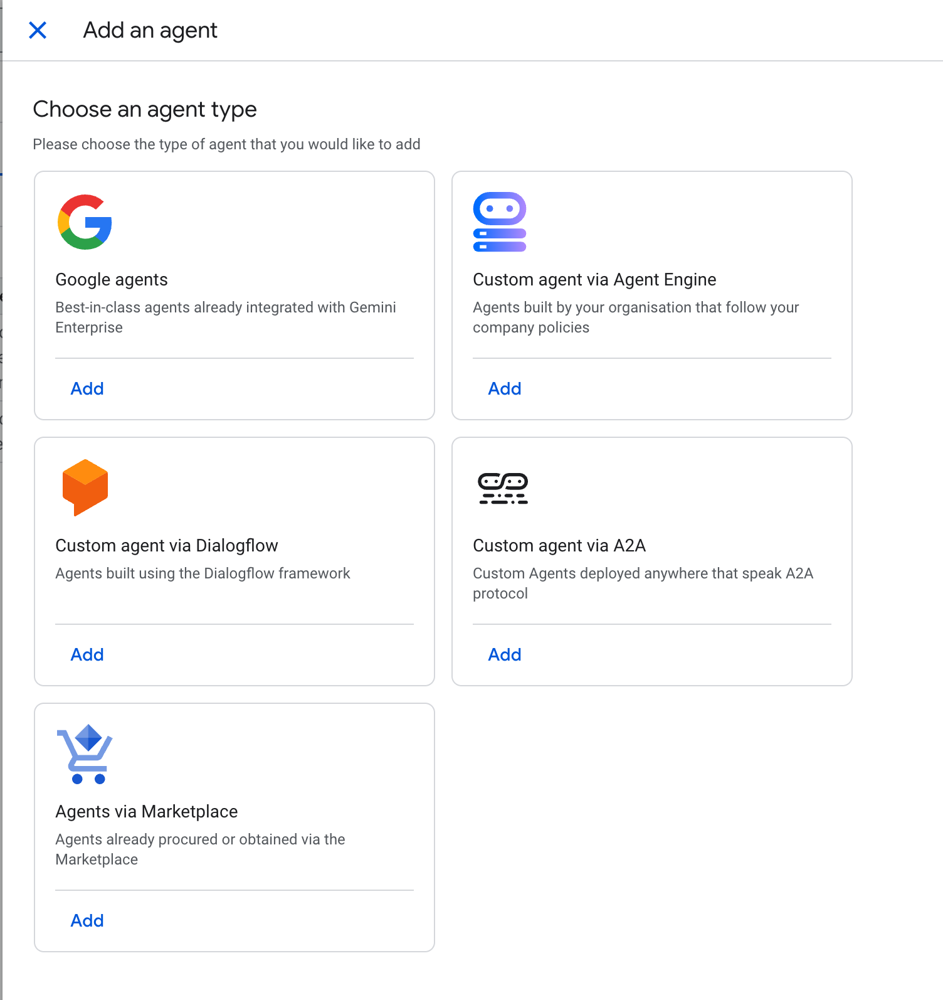

# demand-sensing-agent
Documentation for Devoteam's Demand Sensing Agent

## Project Overview

The **Demand Sensing Agent** is an advanced AI-powered system designed to revolutionize how businesses forecast and respond to market changes. Built on Google Cloud, this agent automates the creation of accurate, short-term demand forecasts by integrating a wide array of relevant data signals. By enabling organizations to access and query real-time market intelligence using natural language, the system significantly reduces manual analysis efforts and empowers proactive decision-making.

## Problem Statement

Demand forecasting in modern business environments faces several critical challenges:

* **Incomplete Market Visibility:** Traditional forecasting methods often fail to incorporate all relevant external data sources, resulting in an incomplete view of real-time market changes that affect demand.
* **Manual Analysis Overhead:** Gathering and analyzing demand sensing data from disparate sources (such as public APIs) is a cumbersome, time-consuming, and highly manual process.
* **Rigid Legacy Systems:** Traditional SAP systems are often limited in their scope and lack the flexibility to seamlessly incorporate a broad, customizable range of modern data signals.
* **Reactive Decision-Making:** The inability to instantly process diverse data signals causes delays, preventing businesses from proactively adapting to rapid market shifts.

## Current Scope

The system currently focuses on core forecasting and actionable intelligence:

* **Automated Short-Term Forecasting:** Generating highly accurate, short-term demand predictions using continuous, real-time data signals.
* **Multi-Source Data Integration:** Accessing and synthesizing real-time demand signals from diverse organizational and external data sources, including customer feedback, social media, and competitor activity.
* **Natural Language Querying:** Allowing users to instantly retrieve complex data insights using conversational prompts (e.g., "Which profit centers show a decline in predicted demand over the next 14 days?").
* **Flexible Data Expansion:** Providing a customizable setup that allows businesses to easily add new demand sources as their operations scale to optimize forecast results.

### Extended Capabilities via Gemini Enterprise
Organizations can seamlessly extend the agent's capabilities from insights into actions by deploying it on Gemini Enterprise:
* **Automated Task Execution:** The agent can autonomously complete operational tasks based on real-time predictions.
* **Autonomous Inventory Management:** The agent can automatically place inventory requests (e.g., ordering higher stock volumes for a specific store) to meet anticipated spikes in demand without requiring manual human intervention.

### Long-Term Vision and Objectives

The strategic roadmap focuses on continued scale, optimization, and advanced simulation:

* **Advanced Demand Scenario Planning with MiroFish:** We plan to host a dedicated instance of **MiroFish** (a multi-agent swarm intelligence simulation engine, preview available at [https://mirofish-demo.pages.dev/](https://mirofish-demo.pages.dev/)) within our demand sensing environment. By leveraging MiroFish, we will be able to construct high-fidelity digital sandboxes populated by thousands of AI agents to simulate complex market dynamics, public reactions, and supply chain shocks. This will allow teams to dynamically stress-test "what-if" demand scenarios and rehearse business strategies before executing them in the real world.
* **Continuous Source Expansion:** Scaling the agent's integration capabilities to ingest an ever-growing, globally diverse list of external demand sources to continuously refine and improve forecast accuracy over time.
* **Cross-System Orchestration:** Deeper bidirectional syncing with broader ERP and supply chain management tools beyond initial inventory request generation.
* **Advanced Predictive Analytics:** Incorporating deeper machine learning models to detect macroeconomic trends and long-tail supply chain disruptions before they manifest in standard market signals.

## System Architecture and Implementation

This project is built as a production-ready, highly observable AI system. The architecture emphasizes powerful data processing, strict quality control, and seamless scalability:

* **Google Cloud Native:** Powered by Google Cloud's Vertex AI, BigQuery, and Cortex technologies to ensure robust, scalable, and instant data retrieval.
* **Rigorous AI Evaluation Framework:** The agent's performance is continuously monitored using Rubric-Based Metrics. An LLM (Gemini) acts as a "Judge" to systematically review the agent's interactions.
* **Comprehensive Quality Metrics:** The agent is evaluated on a 0.0 to 1.0 scale across four key dimensions:
  * *Final Response Quality:* Ensures correctness, relevance, and adherence to formatting instructions.
  * *Tool Use Quality:* Verifies function calling accuracy when interacting with databases or APIs.
  * *Hallucination:* Checks the factuality and consistency of text responses by verifying if claims are properly grounded.
  * *Safety:* Ensures responses are compliant with policies and free of hate speech or dangerous content.
* **Observability and Debugging:** Raw evaluation logs are securely stored in a Google Cloud Storage (GCS) bucket, acting as the source of truth for detailed debugging. Additionally, high-level summaries of evaluation runs can be monitored directly via the Vertex AI Console.

## How to Add the Demand Sensing Agent to Gemini Enterprise

This guide walks administrators through the process of adding our Demand Sensing Agent directly from the Google Cloud Marketplace to your organization's Gemini Enterprise environment.

### Prerequisites
* You must have the **Discovery Engine Admin** role in your Google Cloud project.
* You must have an existing Gemini Enterprise app set up in your Google Cloud console.

---

### Part 1: Add the Agent via the Google Cloud Console (For Admins)

Google Cloud provides a streamlined flow to add Marketplace agents directly into your Gemini Enterprise app.

**Step 1: Navigate to Gemini Enterprise**
Log in to the Google Cloud console and go to the **Gemini Enterprise** page. 

**Step 2: Select Your App**
Click the name of the specific Gemini Enterprise app to which you want to add the Demand Sensing Agent.

**Step 3: Add a Marketplace Agent**
In the left-hand navigation menu, click **Agents**. Then, click the **+ Add Agents** button at the top of the screen.

**Step 4: Choose the Agent Type**
In the "Choose an agent type" section, locate the **Agents via Marketplace** option and click **Add**.

**Step 5: Search and Select**
Search for **[Your Agent's Exact Listing Name]** in the Marketplace search bar. Click on our agent in the results, then click **Next**.
> `[Insert Screenshot: The Marketplace search interface within the console, showing the Demand Sensing Agent selected]`

**Step 6: Authenticate and Finish**
Review the agent details and click **Next**. If prompted, enter the required authentication details (such as OAuth credentials or API keys for your supply chain data) and click **Finish**. 
> `[Insert Screenshot: The final configuration/authentication screen with the "Finish" button highlighted]`

---

### Part 2: Share the Agent with Your Organization (For Admins)

By default, newly added agents need to be shared before your team can see them. 

**Step 1: Open User Permissions**
Still on the **Agents** page in the console, click the Display name of the Demand Sensing Agent you just added. Then, click the **User permissions** tab.
> `[Insert Screenshot: The agent's detail view highlighting the "User permissions" tab]`

**Step 2: Add Users**
Click **Add user**. In the dialog box, you can grant access to specific individuals (User), specific teams (Group/Workforce identity pool), or your entire organization (All users). 
> `[Insert Screenshot: The "Add user permissions roles to agent" dialog box showing the member type selection]`

**Step 3: Save Permissions**
Assign the appropriate role and click **Save**. The agent is now authorized and live for your selected users!
